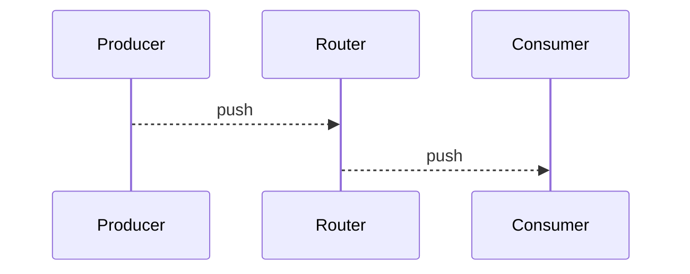

## Introduction

An event-driven architecture uses events to trigger and communicate between decoupled services and is common in modern applications built with microservices. An event is a change in state, or an update, like an item being placed in a shopping cart on an e-commerce website. Events can either carry the state (the item purchased, its price, and a delivery address) or events can be identifiers (a notification that an order was shipped).

Event-driven architectures have three key components: event producers, event routers, and event consumers. A producer publishes an event to the router, which filters and pushes the events to consumers. Producer services and consumer services are decoupled, which allows them to be scaled, updated, and deployed independently.

## Benefits of an event-driven architecture

### Scale and fail independently

By decoupling your services, they are only aware of the event router, not each other. This means that your services are interoperable, but if one service has a failure, the rest will keep running. The event router acts as an elastic buffer that will accommodate surges in workloads.

### Develop with agility

You no longer need to write custom code to poll, filter, and route events; the event router will automatically filter and push events to consumers. The router also removes the need for heavy coordination between producer and consumer services, speeding up your development process.

### Audit with ease

An event router acts as a centralized location to audit your application and define policies. These policies can restrict who can publish and subscribe to a router and control which users and resources have permission to access your data. You can also encrypt your events both in transit and at rest.

### Cut costs

Event-driven architectures are push-based, so everything happens on-demand as the event presents itself in the router. This way, you’re not paying for continuous polling to check for an event. This means less network bandwidth consumption, less CPU utilization, less idle fleet capacity, and less SSL/TLS handshakes.

### Example Architecture

## When to use this architecture

### Cross-account, cross-region data replication

You can use an event-driven architecture to coordinate systems between teams operating in and deploying across different regions and accounts. By using an event router to transfer data between systems, you can develop, scale, and deploy services independently from other teams.

### Resource state monitoring and alerting

Rather than continuously checking on your resources, you can use an event-driven architecture to monitor and receive alerts on any anomalies, changes, and updates. These resources can include storage buckets, database tables, serverless functions, compute nodes, and more.

### Fanout and parallel processing

If you have a lot of systems that need to operate in response to an event, you can use an event-driven architecture to fanout the event without having to write custom code to push to each consumer. The router will push the event to the systems, each of which can process the event in parallel with a different purpose.

### Integration of heterogeneous systems

If you have systems running on different stacks, you can use an event-driven architecture to share information between them without coupling. The event router establishes indirection and interoperability among the systems, so they can exchange messages and data while remaining agnostic.

## Should you use an event-driven architecture?

Event-driven architectures are ideal for improving agility and moving quickly. They’re commonly found in modern applications that use microservices, or any application that has decoupled components. When adopting an event-driven architecture, you may need to rethink the way you view your application design. To set yourself up for success, consider the following:

- The durability of your event source. Your event source should be reliable and guarantee delivery if you need to process every single event. 
- Your performance control requirements. Your application should be able to handle the asynchronous nature of event routers. 
- Your event flow tracking. The indirection introduced by an event-driven architecture allows for dynamic tracking via monitoring services, but not static tracking via code analysis. 
- The data in your event source. If you need to rebuild state, your event source should be deduplicated and ordered.

## Principles

## Patterns

## Standards

## Reference Models

## Decision Framework
