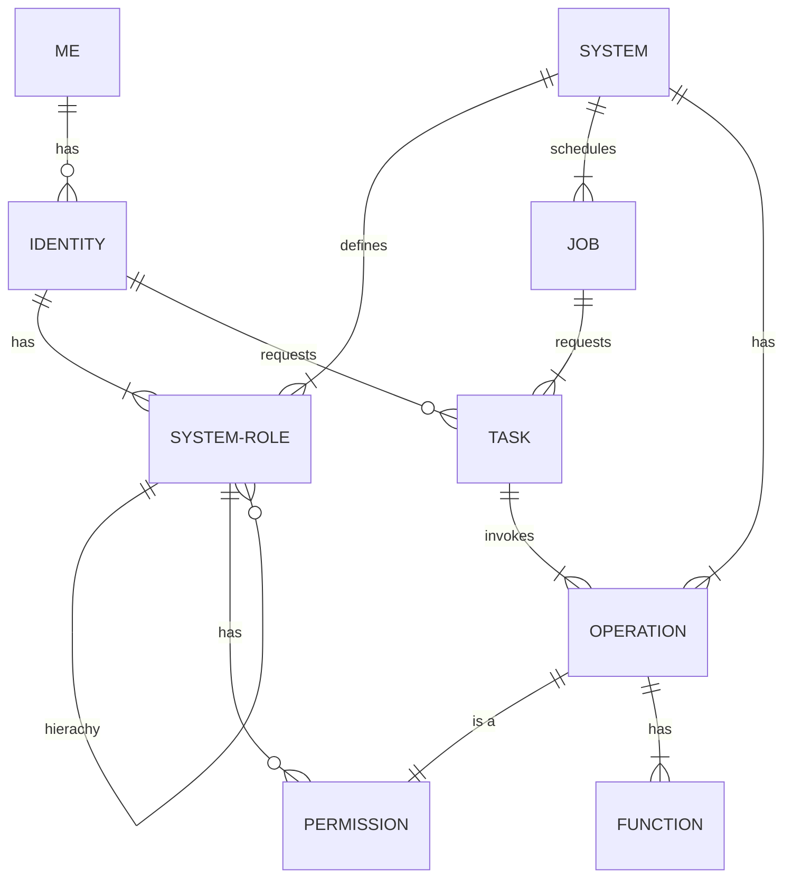

## Interaction Building Blocks

## ME

A Human who needs to use a System, a User.

## Identity

A token representing a User.

## System

A collection of operations that performs work.

## Operation

A collection of functionality.

## System-Role

A collection of operations that performs work.
