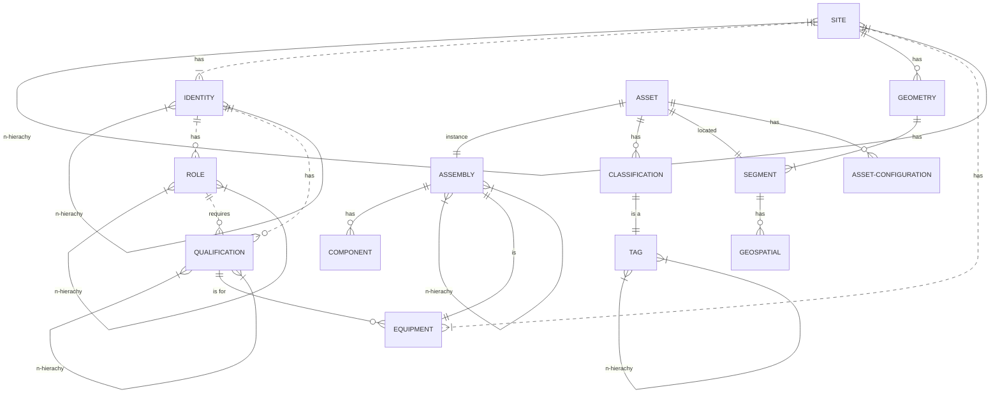

## xDNA Building Blocks

```mermaid
erDiagram

          SITE }|--|{ SITE : "n-hierachy"


          SITE ||..|{ IDENTITY : "has"
          IDENTITY }|--|{ IDENTITY : "n-hierachy"
          IDENTITY ||..o{ ROLE : "has"
          IDENTITY ||..o{ QUALIFICATION : "has"

          ROLE }|--|{ ROLE : "n-hierachy"
          ROLE ||..o{ QUALIFICATION : "requires"

          QUALIFICATION }|--|{ QUALIFICATION : "n-hierachy"
          QUALIFICATION ||--o{ EQUIPMENT : "is for"  

          SITE ||--o{ GEOMETRY : "has"
          GEOMETRY ||--|{ SEGMENT : "has"
          SEGMENT ||--o{ GEOSPATIAL : "has"
          
          SITE ||..|{ EQUIPMENT : "has"
          CLASSIFICATION ||--|| TAG : "is a"
          TAG }|--|{ TAG : n-hierachy

          ASSET ||--|| ASSEMBLY : "instance"
          ASSET ||--o{ CLASSIFICATION : "has"
          ASSET ||--|| SEGMENT : "located"
          ASSET ||--o{ ASSET-CONFIGURATION : "has"


          ASSEMBLY ||--o{ COMPONENT : "has"
          ASSEMBLY }|--|{ ASSEMBLY : "n-hierachy"

          ASSEMBLY ||--|| EQUIPMENT : "is"

 

                    

```

## Equipment

A virtual description of an Asset class

## Assembly

A digital template used to describe as Asset.

## Asset

A digital twin of a physical Assembly
