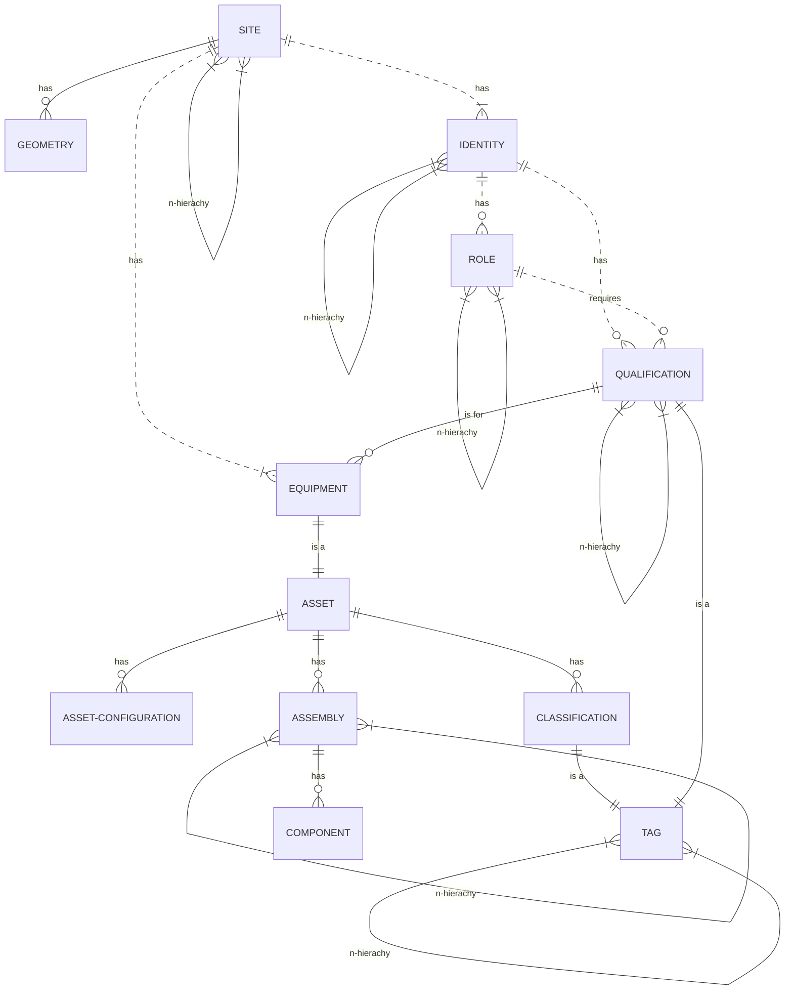

## xDNA Building Blocks

```mermaid
erDiagram

          SITE }|--|{ SITE : "n-hierachy"
          SITE ||--o{ GEOMETRY : "has"
          SITE ||..|{ EQUIPMENT : "has"

          EQUIPMENT ||--|| ASSET : "is a"    

          ASSET ||--o{ ASSET-CONFIGURATION : "has"
          ASSET ||--o{ CLASSIFICATION : "has"

          CLASSIFICATION ||--|| TAG : "is a"
          TAG }|--|{ TAG : n-hierachy
          ASSET ||--o{ ASSEMBLY : "has"

          ASSEMBLY }|--|{ ASSEMBLY : "n-hierachy"
          ASSEMBLY ||--o{ COMPONENT : "has"

          SITE ||..|{ IDENTITY : "has"
          IDENTITY }|--|{ IDENTITY : "n-hierachy"
          IDENTITY ||..o{ ROLE : "has"
          IDENTITY ||..o{ QUALIFICATION : "has"

          ROLE }|--|{ ROLE : "n-hierachy"
          ROLE ||..o{ QUALIFICATION : "requires"

          QUALIFICATION }|--|{ QUALIFICATION : "n-hierachy"
          QUALIFICATION ||--|| TAG : "is a"
          QUALIFICATION ||--o{ EQUIPMENT : "is for"

          

```
