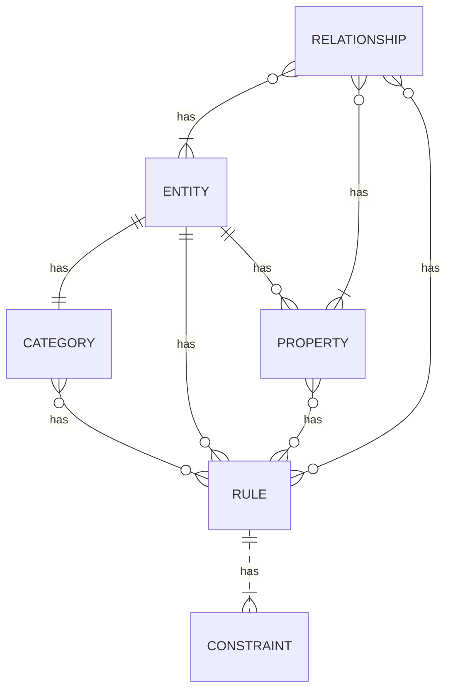

## Categories of Entities

Entities are categorized based on their functions and the type of data that they serve. The following are five categories for data entities.

### Parameter

- Functional or behavioral parameters.
- Required to set up a deployment or a module for a specific build or customer.
- Can include data that is specific to an industry or business. The data can also apply to a broader set of - customers.
- Tables that contain only one record, where the columns are values for settings. Examples of such tables - exist for Account payable (AP), General ledger (GL), client performance options, workflows, and so on.

### Reference

- Simple reference data, of small quantity, which is required to operate a business process.
- Data that is specific to an industry or a business process.
- Examples include units, dimensions, and tax codes.

### Master

-Data assets of the business. Generally, these are the "nouns" of the business, which typically fall into categories such as people, places, and concepts.
-Complex reference data, of large quantity. Examples include customers, vendors, and projects.

### Document

- Worksheet data that is converted into transactions later.
- Documents that have complex structures, such a several line items for each header record. Examples include sales orders, purchase orders, open balances, and journals.
- The operational data of the business.

### Transaction

- The operational transaction data of the business.
- Posted transactions. These are non idempotent items such as posted invoiced and balances. Typically, these items are excluded during a full dataset copy to reduce the volume of data that is copied/migrated. Migrating completed transactions can also lead to further complexity in trying to preserve the referential integrity of related data in the new system. In general, transactions from a completed business process are not migrated in detail but in summary.
- Examples include pending invoices.

## Useful

### Relationship

- An association between entities.

### Property

- A value.

### Rule

- A Set of contraints that makes to determine validity within a context.

