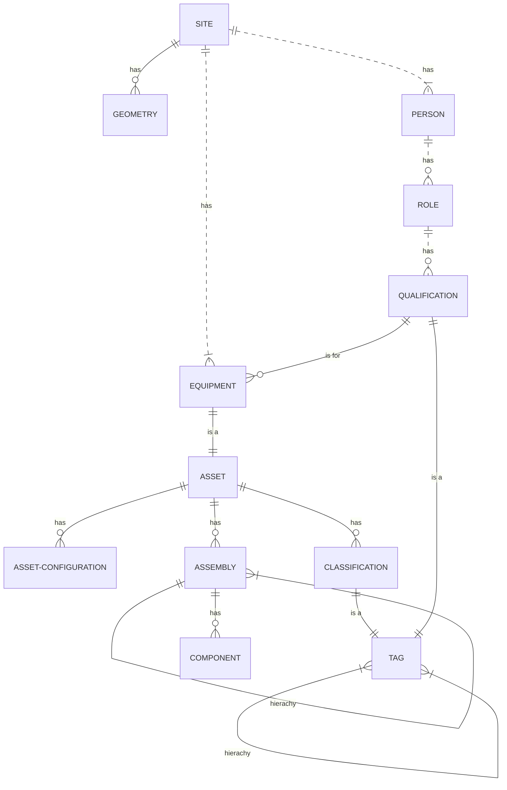

## Introduction

```mermaid
erDiagram
          SITE ||--o{ GEOMETRY : "has"

          SITE ||..|{ EQUIPMENT : "has"
          EQUIPMENT ||--|| ASSET : "is a"          
          ASSET ||--o{ ASSET-CONFIGURATION : "has"
          ASSET ||--o{ CLASSIFICATION : "has"
          CLASSIFICATION ||--|| TAG : "is a"
          TAG }|--|{ TAG : hierachy
          ASSET ||--o{ ASSEMBLY : "has"
          ASSEMBLY ||--|{ ASSEMBLY : "hierachy"
          ASSEMBLY ||--o{ COMPONENT : "has"

          SITE ||..|{ PERSON : "has"
          PERSON ||..o{ ROLE : "has"
          ROLE ||..o{ QUALIFICATION : "has"
          QUALIFICATION ||--|| TAG : "is a"
          QUALIFICATION ||--o{ EQUIPMENT : "is for"

```

## Background

## Who should read this document?

## Principles

## Patterns

## Standards

## Reference Models

## Decision Framework
