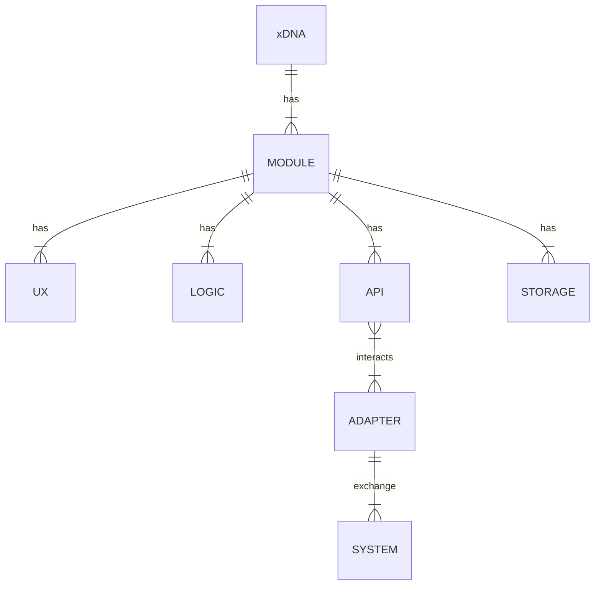

## Introduction

xDNA serves as an information model for the exchange of system information.

It facilitates standards-based interoperability between systems: providing a model to allow systems to exchange data.

## Modules

### Configuration Management

- Assets
- Asset Tracking
- Locations
- Manufacturers & Models
- Specifications
- Sites & Organisations
- Networks
- Geospatial
- Documentation

### Resource Management

- Materials & Consumables
- Labour
- Tools
- Personel

### Operation & State

- Sensors
- Meters
- Alarms
- Events
- Sampling

### Condition

- Health Assessment
- Predictions

### Work Management

- Planning
- Requests
- Tracking
- Supply & Logistics

### Reliability

- Faults & Failures
- Work History
- Quantitative Assessment (Engineering)
- Tracking

### Reference & Metadata

- Types & Tags
- Taxonomies
- Templates
- Data Authority (System of Record & Sources of Truth

