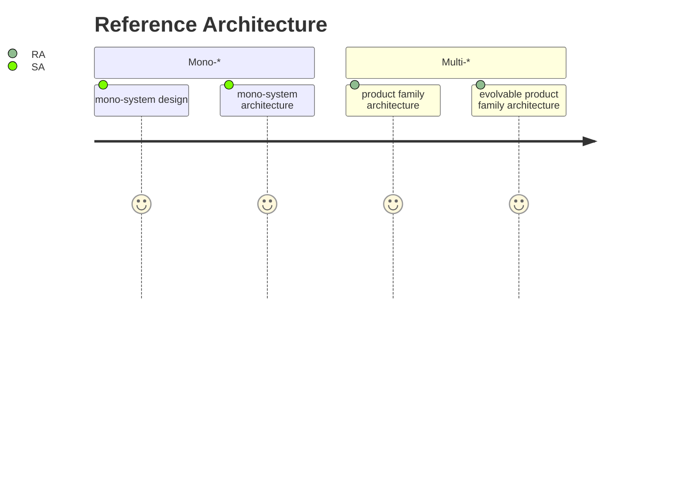
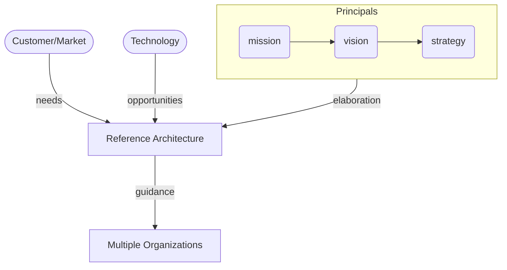

{}
Identifies goals and objectives of the Reference Architecture and describes the specific purpose
{}

## Definition

An authoritative source of information about a specific subject area that guides and constrains the instantiations of multiple architectures and solutions.

## A Reference Architecture comprises the following components

- Introduction.  Identifies goals and objectives of the Reference Architecture and describes the specific purpose.
- Discussion.  Provides the background and rationale for the content of the Reference Architecture.  Headings are appropriate to the content.
- Principles.  High-level guidance for the entire Reference Architecture.
- Reference Model.  A taxonomy of accepted concepts to describe capability.
- Decision Frameworks.  Recommended combinations of Standards and Patterns for typical use cases based on the Reference Model.
- Standards.  Descriptions of preferred data formats or interface specifications that support the Reference Architecture’s technical intent.
- Patterns.  Descriptions of preferred technologies, designs and data formats that solve specific use cases.

```mermaid

flowchart TB

    A(Principals)
    B(Reference Model)
    C(Standards)
    D(Patterns)
    E(Decision Frameworks)

    A --> C
    B --> C
    C --> D
    C --> E
    D --> E

click A "" "principals"
click B "" "reference-models"
click C "" "standards"
click D "" "patterns"
click E "" "decision-framework"

```

## Why use reference Architectures?

To facilitate multi-[site | vendor | organisation | *anything*] system creation and lifecycle support.

- providing a common lexicon and taxonomy
- providing a common (architectural) vision
- providing modularization and complementary context

Increase dynamic integration and achieve interoperability between many different and evolving systems.

- Articulation of domain and realization concepts
- Explicit modelling of functions and qualities above systems level
- Explicit decisions about compatibility, upgrade and interchangeability

To achieve increased complexity scope and size so that we may effectively create new products, product lines and product portfolios.

- providing guidance, e.g. architecture principles and practices
- providing an architecture baseline and an architecture blueprint
- capturing and sharing (architectural) patterns

## When to use Reference Architectures?

Reference Architectures facilitate the step towards product family architecture and evolvability; this often coincides with multi-\* problems. Single System Architectures tend to fall short in addressing the bigger set of problems that emerge in multi-system domains.



### Reference Architectures Elaborates Mission, Vision and Strategy


